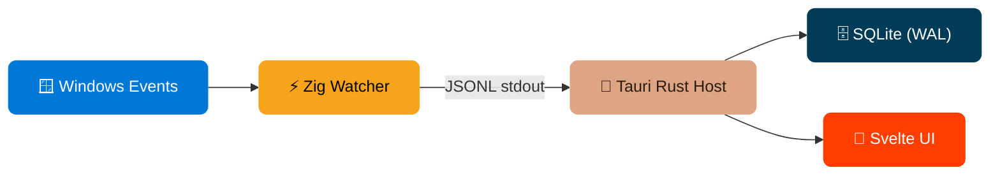

<div align="center">

# 🛡️ Sentry

### Low-Overhead Windows Activity Monitor

*Silent Pulse of Productivity*

<br/>

[](https://github.com/ryanastro-dev/sentry/actions/workflows/ci.yml)
[](https://github.com/ryanastro-dev/sentry/actions/workflows/release.yml)


</div>

---

## 📋 Overview

**Sentry** tracks active window usage on Windows in near real-time and stores local timeline & session data for digital wellbeing insights — all while staying under **6 MB of memory** and consuming **~0% CPU**.

<table>
<tr>
<td width="50%">

### ✨ Key Features

- 🎯 **Event-first foreground tracking** via `SetWinEventHook` with polling fallback
- 🧩 **Sidecar isolation** — Zig watcher handles low-level capture, Rust host manages lifecycle
- 💾 **Local-first storage** in SQLite (WAL mode) with timeline & usage queries
- 📊 **Live dashboard** for current activity, recent sessions, and top usage

</td>
<td width="50%">

### 📈 Performance

| Metric       | Value     | Target   |
|:------------|:----------|:---------|
| RSS Average | `5.45 MB` | < 8 MB ✅ |
| RSS Peak    | `5.61 MB` | < 8 MB ✅ |
| CPU Average | `~0%`     | < 1%   ✅ |
| CPU Peak    | `0%`      | < 1%   ✅ |

</td>
</tr>
</table>

---

## 🏗️ Architecture



| Component | Language | Responsibility |
|:----------|:---------|:---------------|
| **Zig Watcher** | Zig | Captures foreground window transitions, resolves PID/exe/title, emits JSONL |
| **Tauri Host** | Rust | Spawns/monitors sidecar, validates events, writes to SQLite |
| **SQLite Layer** | SQL | WAL-mode persistence with `apps`, `windows`, `focus_events`, `sessions` tables |
| **Dashboard** | Svelte | Live activity panel, usage charts, session timeline |

---

## 📁 Project Layout

```
sentry/
├── 📄 README.md
├── 📂 .github/workflows/    # CI + Release pipelines
├── 📂 docs/                  # Architecture, backlog, limitations, perf reports
│   ├── ARCHITECTURE.md
│   ├── PROJECT_PLAN.md
│   ├── IMPLEMENTATION_BACKLOG.md
│   ├── KNOWN_LIMITATIONS.md
│   └── perf/                 # Benchmark & soak test results
├── 📂 scripts/               # PowerShell build, check, benchmark, soak scripts
├── 📂 watcher-zig/           # Zig sidecar watcher
│   ├── build.zig
│   ├── build.zig.zon
│   └── src/main.zig
└── 📂 ui/                    # Tauri + Svelte frontend
    ├── index.html
    ├── package.json
    ├── src/                  # Svelte components & styles
    └── src-tauri/            # Rust host application
        ├── Cargo.toml
        ├── tauri.conf.json
        └── src/
            ├── main.rs       # Tauri setup, commands, monitor loop
            ├── db.rs         # SQLite operations
            └── models.rs     # Shared data models
```

---

## ⚙️ Prerequisites

| Requirement | Version | Notes |
|:-----------|:--------|:------|
| **OS** | Windows 10/11 (x64) | — |
| **PowerShell** | 5.1+ | Pre-installed on Windows |
| **Rust** | 1.94.0+ | [Install](https://rustup.rs/) |
| **Node.js** | 24+ | [Install](https://nodejs.org/) |
| **npm** | 11+ | Bundled with Node.js |

> **Note**: Zig `0.15.2` is automatically bootstrapped to `.tools/` on first build — no manual install needed.

---

## 🚀 Quick Start

### 1️⃣ Build the Zig Watcher Sidecar

```powershell
powershell -ExecutionPolicy Bypass -File .\scripts\build-watcher.ps1
```

### 2️⃣ Install Frontend Dependencies

```powershell
cd ui
npm install
```

### 3️⃣ Run in Development Mode

```powershell
npm run tauri:dev
```

---

## 🔧 Development Commands

<details>
<summary><strong>📦 Build & Check</strong></summary>

| Command | Description |
|:--------|:-----------|
| `.\scripts\build-watcher.ps1` | Build the Zig watcher sidecar |
| `.\scripts\build-watcher.ps1 -Run` | Build and run watcher directly |
| `.\scripts\run-checks.ps1` | Run all local checks (Zig + Rust + UI) |
| `.\scripts\run-checks.ps1 -WithTauriBuild` | Full checks including Tauri debug build |

</details>

<details>
<summary><strong>🏎️ Performance & Soak Testing</strong></summary>

| Command | Description |
|:--------|:-----------|
| `.\scripts\benchmark-watcher.ps1 -DurationSeconds 30 -SampleMs 500` | Short CPU/RAM benchmark |
| `.\scripts\soak-watcher.ps1 -DurationSeconds 86400 -SampleMs 5000` | One-shot 24h soak test |
| `.\scripts\start-soak.ps1` | Start background soak run |
| `.\scripts\check-soak.ps1` | Check soak status |
| `.\scripts\stop-soak.ps1` | Stop background soak run |

Reports are saved to `docs/perf/`.

</details>

<details>
<summary><strong>🚢 Release Build</strong></summary>

```powershell
cd ui
npm run tauri:build
```

Release artifacts:
- `sentry-vX.Y.Z-windows-x64.exe`
- `sentry-vX.Y.Z-windows-x64.msi`

</details>

---

## 🔌 Event Contract

The Zig watcher emits one JSON object per line (`\n`-delimited, UTF-8) to stdout:

```json
{
  "ts_unix_ms": 1710000000000,
  "event": "focus_changed",
  "hwnd": "0x00030A9E",
  "pid": 12345,
  "exe_path": "C:\\Program Files\\Google\\Chrome\\Application\\chrome.exe",
  "window_title": "Example - Google Chrome",
  "prev_duration_ms": 1834
}
```

| Field | Type | Required | Notes |
|:------|:-----|:---------|:------|
| `ts_unix_ms` | `i64` | ✅ | Millisecond-precision Unix timestamp |
| `event` | `string` | ✅ | Always `"focus_changed"` |
| `hwnd` | `string` | ✅ | Window handle as hex string |
| `pid` | `u32` | ✅ | Process ID |
| `exe_path` | `string` | ⚠️ | May be empty on access-denied |
| `window_title` | `string` | ⚠️ | May be empty for some apps |
| `prev_duration_ms` | `i64` | ✅ | `0` for first event |

---

## 📚 Documentation

| Document | Description |
|:---------|:-----------|
| [`ARCHITECTURE.md`](docs/ARCHITECTURE.md) | System design, component responsibilities, data contracts |
| [`PROJECT_PLAN.md`](docs/PROJECT_PLAN.md) | Milestones, risk analysis, acceptance criteria |
| [`IMPLEMENTATION_BACKLOG.md`](docs/IMPLEMENTATION_BACKLOG.md) | Sprint task checklist with completion status |
| [`KNOWN_LIMITATIONS.md`](docs/KNOWN_LIMITATIONS.md) | Runtime edge cases and verification scope |

---

## 📊 Version Baseline

<table>
<tr>
<td>

| Component | Version |
|:----------|:--------|
| Zig | `0.15.2` |
| Rust | `1.94.0` |
| Tauri | `2.10.3` |

</td>
<td>

| Component | Version |
|:----------|:--------|
| Svelte | `5.53.11` |
| SQLite | `3.52.0` |
| `@tauri-apps/api` | `2.10.1` |

</td>
</tr>
</table>

> **Policy**: Stable releases only — no `-dev`, `master`, or prerelease artifacts.

---

## ✅ Project Status

- [x] ⚡ Zig watcher — event hook + polling fallback + unit tests
- [x] 🦀 Rust host — ingestion + restart/backoff + SQLite pipeline
- [x] 🎨 Svelte dashboard — live activity, timeline, usage summary
- [x] 🔧 Local verification scripts + benchmark harness
- [x] 🏗️ CI/CD — automated checks + release pipeline
- [ ] 📋 24h soak test final report *(in progress)*

---

<div align="center">

Built with ⚡ **Zig** · 🦀 **Rust** · 🎨 **Svelte** · 🗄️ **SQLite**

</div>
