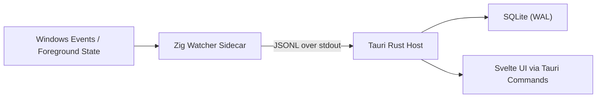

# Sentry Core Architecture (Stable Track)

Last updated: 2026-03-12

## 1) High-Level Flow



## 2) Components

### Zig Watcher (`watcher-zig`)

Responsibilities:
- Capture foreground window transitions
- Resolve PID -> executable path
- Resolve window title
- Compute duration of previous active session
- Emit normalized JSON lines

Win32 API surface:
- `SetWinEventHook`, `UnhookWinEvent`
- `GetForegroundWindow`
- `GetWindowThreadProcessId`
- `OpenProcess`, `CloseHandle`
- `QueryFullProcessImageNameW`
- `GetWindowTextW`

Runtime model:
- Event-first path via WinEvent hook
- 1s polling fallback for resilience
- Internal dedupe by `(hwnd, title_utf8)`

### Tauri Rust Host (`ui/src-tauri`)

Responsibilities:
- Spawn/monitor sidecar process
- Parse and validate JSONL
- Single-writer SQLite persistence
- Serve query commands to UI

Core behaviors:
- Restart policy on sidecar crash (bounded exponential backoff)
- Structured error logging
- Graceful shutdown: flush pending writes before exit

### Svelte UI (`ui`)

Responsibilities:
- Show current active app/window
- Render daily timeline
- Render app usage summary

Data access:
- Pull from Tauri commands (no direct DB in UI layer)

## 3) Event Contract (Zig -> Rust)

Transport:
- One JSON object per line (`\n`) on stdout
- UTF-8 encoded

Schema v1:

```json
{
  "ts_unix_ms": 1710000000000,
  "event": "focus_changed",
  "hwnd": "0x00030A9E",
  "pid": 12345,
  "exe_path": "C:\\Program Files\\Google\\Chrome\\Application\\chrome.exe",
  "window_title": "Example - Google Chrome",
  "prev_duration_ms": 1834
}
```

Validation rules:
- `ts_unix_ms`, `pid` required and positive
- `exe_path` may be empty on access-denied/process-race
- `window_title` may be empty
- `prev_duration_ms` is `0` for first observed session

## 4) Database Contract (Rust -> SQLite)

Recommended schema v1:
- `apps(id INTEGER PK, exe_path TEXT UNIQUE NOT NULL, name TEXT NOT NULL)`
- `windows(id INTEGER PK, app_id INTEGER NOT NULL, title TEXT NOT NULL, UNIQUE(app_id, title))`
- `focus_events(id INTEGER PK, ts_unix_ms INTEGER NOT NULL, app_id INTEGER, window_id INTEGER, pid INTEGER, hwnd TEXT)`
- `sessions(id INTEGER PK, app_id INTEGER, window_id INTEGER, start_unix_ms INTEGER NOT NULL, end_unix_ms INTEGER NOT NULL, duration_ms INTEGER NOT NULL)`

Operational settings:
- `PRAGMA journal_mode=WAL`
- `PRAGMA synchronous=NORMAL`
- Batched inserts in short transactions

## 5) Error and Edge-Case Policy

- Process exits between PID fetch and path query:
  - emit event with `exe_path=""`, keep PID if known
- Access denied from `OpenProcess`:
  - emit partial event, classify error type
- Empty title:
  - treat as valid; dedupe still uses HWND + title tuple
- Sidecar stdout malformed line:
  - drop line, increment parse error counter, continue stream

## 6) Performance Strategy

- Avoid heap churn in hot path:
  - reuse buffers for title/path where possible
- Cache PID -> exe path with TTL
- Minimize system calls in unchanged-focus intervals
- Keep Rust writer single-threaded for DB consistency

## 7) Test Strategy

Unit tests:
- UTF-16 -> UTF-8 conversion
- Change detection logic
- Session duration arithmetic
- JSON schema parse and validation

Integration tests:
- Sidecar spawn + stdout ingestion
- DB transaction and query correctness
- Restart policy behavior

Soak tests:
- 24h run with periodic window changes
- Validate no handle leaks, no unbounded memory growth

## 8) Packaging Targets

Primary target:
- `x86_64-pc-windows-msvc`

Release artifact:
- Tauri app bundle including Zig sidecar binary

Version policy:
- Stable-only upgrade path; lock versions per release branch.
